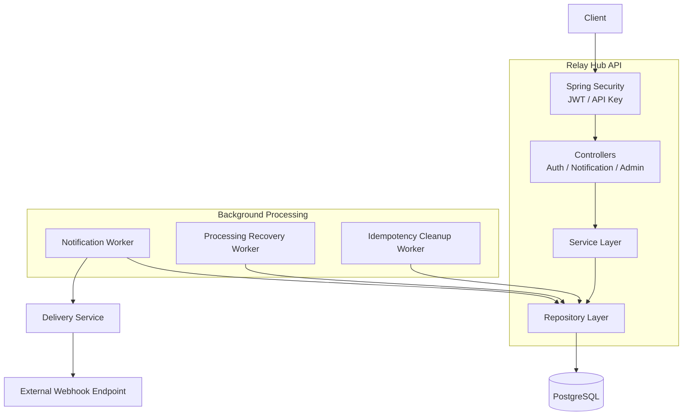
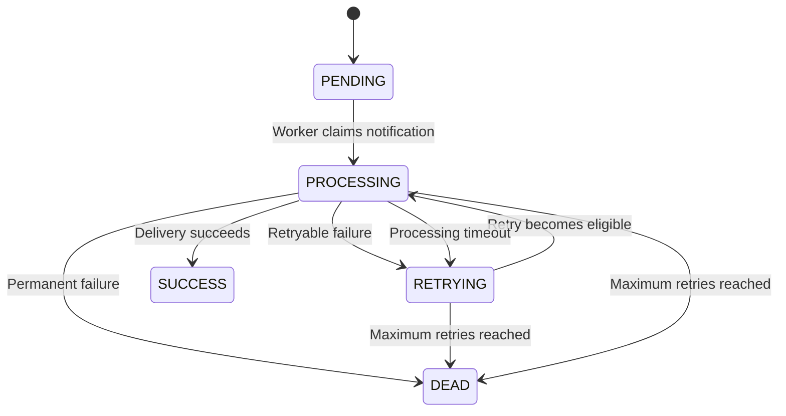

# Relay Hub

A reliable webhook delivery platform built with Java, Spring Boot, and PostgreSQL.

Relay Hub allows clients to schedule HTTP webhook notifications and deliver them asynchronously to external services. It keeps notification state in PostgreSQL, handles retryable failures with exponential backoff, prevents duplicate notification creation using idempotency keys, records delivery history, and recovers notifications that become stuck during processing.

## Key Engineering Problems

- Persistent database-backed notification processing using PostgreSQL row-level locking and `FOR UPDATE SKIP LOCKED`
- Retryable webhook delivery with exponential backoff and processing recovery
- Database-backed idempotency for repeated and concurrent requests
- SSRF-aware webhook destination validation and disabled automatic redirects

## Key Features

| Feature | Description |
| :--- | :--- |
| Webhook Scheduling | Create notifications for immediate or future delivery |
| Asynchronous Delivery | Deliver notifications through a background worker instead of blocking the API request |
| Retry Handling | Automatically retry temporary delivery failures |
| Exponential Backoff | Increase the delay between retry attempts |
| Idempotency | Prevent duplicate notifications when clients repeat a request |
| Concurrent Worker Processing | Use PostgreSQL `FOR UPDATE SKIP LOCKED` to safely claim work |
| Delivery History | Record notification state transitions and delivery results |
| Dead Notification Handling | Move permanently failed notifications to `DEAD` |
| Processing Recovery | Recover notifications that remain in `PROCESSING` beyond a configured timeout |
| SSRF Protection | Validate webhook destinations before making outbound requests |
| JWT Authentication | Stateless authentication using signed JWTs |
| API-Key Authentication | Authentication mechanism for machine-to-machine clients |
| Role-Based Authorization | Restrict administrative endpoints to `ADMIN` users |
| Pagination | Paginate administrative notification queries |
| JSON Payloads | Store webhook payloads as PostgreSQL `JSONB` |
| Docker Compose | Run the application and PostgreSQL together |
| Database Migrations | Manage schema changes with Flyway |
| API Documentation | Expose API documentation through OpenAPI and Swagger UI |

## Quick Start

The easiest way to run Relay Hub locally is with Docker Compose.

### Prerequisites

- Docker
- Docker Compose

### Start the application

```bash
git clone <repository-url>
cd relay-hub
docker compose up --build
```

The application and PostgreSQL database start together. PostgreSQL is health-checked before the application starts, and Flyway applies database migrations during application startup.

**API**

```text
http://localhost:8082
```

**Swagger UI**

```text
http://localhost:8082/swagger-ui/index.html
```

## Architecture

Relay Hub follows a layered Spring Boot architecture. The HTTP layer receives requests, the service layer contains application logic, repositories handle persistence, and background workers process notifications independently of API requests.



The API and worker components share PostgreSQL as the source of truth. The worker does not depend on an in-memory queue, so notification state remains available across application restarts.

## Notification Lifecycle

A notification starts as `PENDING` and is claimed by a worker when it becomes eligible for processing.




The normal successful path is `PENDING → PROCESSING → SUCCESS`. Temporary failures can move through `RETRYING`, while permanent failures eventually reach `DEAD`. Notification history records these transitions.

## Reliability

Relay Hub uses PostgreSQL as a database-backed work queue. Eligible `PENDING` and `RETRYING` notifications are claimed using `FOR UPDATE SKIP LOCKED`. The claim transaction commits before the external HTTP request is made so a slow or unavailable external service does not hold database locks.

Retryable failures include HTTP `408`, `429`, `5xx`, and network/connection/timeout failures where no HTTP status is available. Other `4xx` responses are permanent failures. Retry delay follows `2 ^ retryCount` minutes, with a configurable maximum retry count.

A separate recovery worker handles notifications that remain in `PROCESSING` beyond the configured processing timeout.

See [Reliability & Idempotency](docs/reliability.md) and [Concurrency & Architecture](docs/architecture.md).

## Idempotency

Creating a notification requires an `Idempotency-Key`. The database enforces uniqueness on `(key_name, user_id)`. Concurrent requests using the same key are resolved through the database constraint; the losing request retrieves the existing idempotency record.

Idempotency records older than 24 hours are periodically removed by a scheduled cleanup worker.

## Security

Relay Hub supports JWT and API-key authentication and role-based authorization for administrative APIs. Passwords use BCrypt, API keys are stored as SHA-256 hashes, and webhook destinations are validated to reduce SSRF risk. The webhook HTTP client does not automatically follow redirects.

See [Security](docs/security.md).

## API

### Authentication

| Method | Endpoint | Description | Authentication |
| :--- | :--- | :--- | :--- |
| `POST` | `/auth/register` | Register a new user | Public |
| `POST` | `/auth/login` | Authenticate a user and obtain a JWT | Public |

### Notifications

| Method | Endpoint | Description | Authentication |
| :--- | :--- | :--- | :--- |
| `POST` | `/api/notifications` | Create and schedule a notification | JWT / API Key |
| `GET` | `/api/notifications/{id}` | Get a user's notification | JWT / API Key |

### Administration

| Method | Endpoint | Description | Authentication |
| :--- | :--- | :--- | :--- |
| `POST` | `/api/admin/register` | Create an administrator | ADMIN |
| `GET` | `/api/admin/metrics` | Get notification counts by status | ADMIN |
| `GET` | `/api/admin/notifications` | Get system notifications with pagination | ADMIN |

Creating a notification requires `Idempotency-Key: <unique-key>` and contains a target webhook URL, JSON payload, and optional scheduled time. If `scheduledTime` is not supplied, the notification is scheduled for immediate processing.

See [API & Data Model](docs/api.md) for the complete example and data model.

## Testing

The project uses Spring's testing support, Testcontainers, and WireMock, including PostgreSQL integration testing and external webhook simulation.

Important workflow coverage includes:

| Scenario | Expected Flow | Result |
| :--- | :--- | :--- |
| 4xx response | `DEAD` | Passed |
| Repeated 5xx responses | `RETRYING → DEAD` | Passed |
| Temporary 5xx failures | `RETRYING → SUCCESS` | Passed |

See [Testing](docs/testing.md) for the complete test setup and results.

## Performance Results

Relay Hub was tested with application-level load tests, database/index benchmarking, worker processing tests, and retry/failure workflow tests. These results were collected from the local development environment and are not production capacity measurements.

### API Ingestion

| VUs | Requests | Throughput | P50 | P95 | Error Rate |
|---:|---:|---:|---:|---:|---:|
| 10 | 13,169 | 54.74 RPS | 33.71 ms | 61.95 ms | 0.35% |
| 20 | 10,979 | 45.42 RPS | 40.99 ms | 77.80 ms | 0.61% |
| 30 | 14,092 | 52.06 RPS | 29.24 ms | 67.93 ms | 0.93% |

### Mixed Read/Write

| Run | Throughput | Median | P95 | Error Rate |
|---|---:|---:|---:|---:|
| 1 | 62.02 req/s | 24.10 ms | 54.51 ms | 0.42% |
| 2 | 72.82 req/s | 20.53 ms | 49.08 ms | 0.39% |

### Queue Index Benchmark

| Configuration | Execution Time |
|---|---:|
| Without indexes | 260.284 ms |
| With indexes | 36.366 ms |

The indexed query was approximately **7.15× faster** for the tested dataset.

### Worker Processing

```text
Notifications created: 10,001
Checks succeeded:      10,001
Checks failed:              0
Throughput:             56 notifications/second
Remaining PENDING:      0
```

See [Performance](docs/performance.md) for the complete methodology and observations.

## Tech Stack

- Java 21
- Spring Boot 4.1.0
- Spring Web MVC
- Spring Data JPA
- Spring Security
- Jakarta Validation
- PostgreSQL 17
- Flyway
- PostgreSQL JSONB
- JWT
- BCrypt
- SHA-256 API-key hashing
- Spring `RestClient`
- OpenAPI / Swagger UI
- Docker / Docker Compose
- Spring Boot Test
- Spring Security Test
- Testcontainers
- PostgreSQL Testcontainer
- WireMock

## Engineering Documentation

- [Architecture, Lifecycle & Concurrency](docs/architecture.md)
- [Reliability & Idempotency](docs/reliability.md)
- [Security & Authentication](docs/security.md)
- [API & Data Model](docs/api.md)
- [Configuration & Local Development](docs/configuration.md)
- [Testing](docs/testing.md)
- [Performance](docs/performance.md)
- [Project Structure, Design Decisions, Error Handling & Observability](docs/engineering.md)