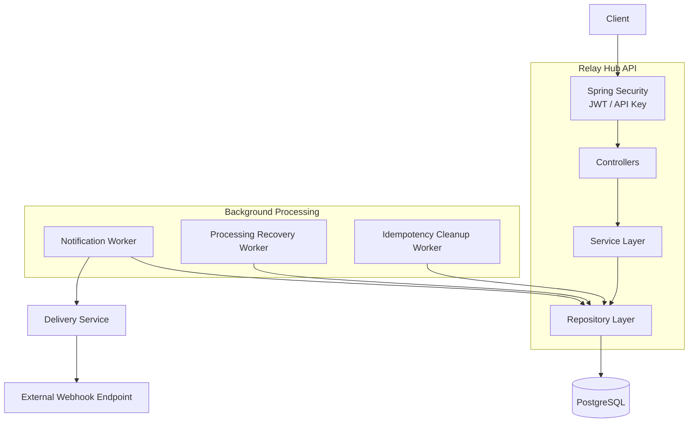
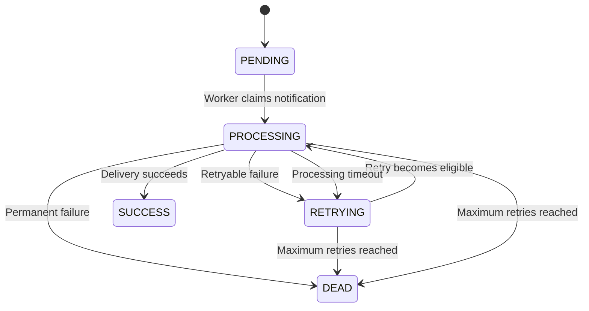
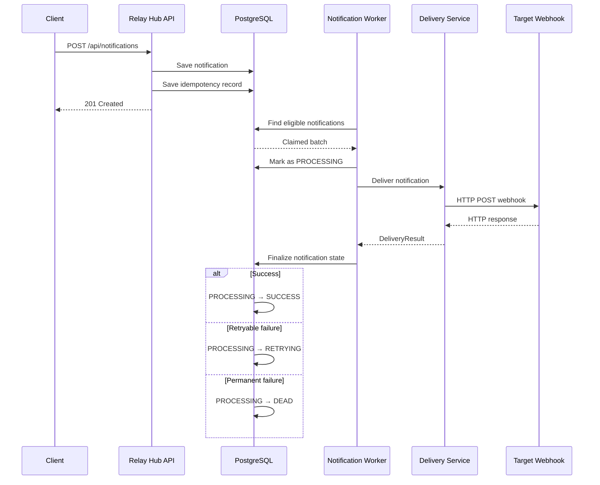
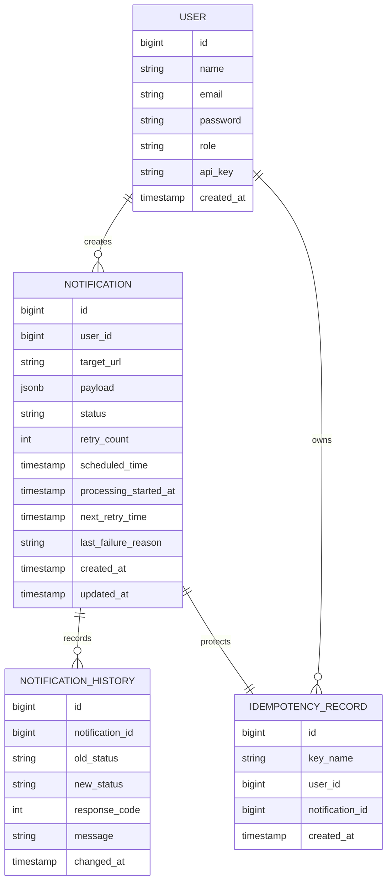

# Relay Hub

A reliable webhook delivery platform built with Java, Spring Boot, and PostgreSQL.

Relay Hub allows clients to schedule HTTP webhook notifications and deliver them asynchronously to external services. It keeps notification state in PostgreSQL, handles retryable failures with exponential backoff, prevents duplicate notification creation using idempotency keys, records delivery history, and recovers notifications that become stuck during processing.

## Overview

Sending a webhook is simple when everything works. The difficult part is handling the cases where the target service is unavailable, a request times out, a client retries the same API request, or the application stops while a notification is being processed.

Relay Hub is built around these cases.

The application:

- Accepts and validates webhook notification requests
- Supports immediate and scheduled delivery
- Processes notifications asynchronously using a background worker
- Retries temporary delivery failures with exponential backoff
- Prevents duplicate notification creation with idempotency keys
- Stores notification state and delivery history
- Recovers notifications stuck in `PROCESSING`
- Moves permanently failed notifications to `DEAD`
- Validates webhook destinations to reduce SSRF risk
- Supports JWT and API-key authentication
- Uses role-based authorization for administrative APIs
- Provides basic system metrics and administrative notification access

PostgreSQL is used as the persistent source of truth for notification state. Background workers claim work directly from the database using row-level locking.

## Key Features

| Feature | Description |
| :--- | :--- |
| Webhook Scheduling | Create notifications for immediate or future delivery |
| Asynchronous Delivery | Deliver notifications through a background worker instead of blocking the API request |
| Retry Handling | Automatically retry temporary delivery failures |
| Exponential Backoff | Increase the delay between retry attempts |
| Idempotency | Prevent duplicate notifications when clients repeat a request |
| Concurrent Worker Processing | Use PostgreSQL `FOR UPDATE SKIP LOCKED` to safely claim work |
| Delivery History | Record notification state transitions and delivery results |
| Dead Notification Handling | Move permanently failed notifications to `DEAD` |
| Processing Recovery | Recover notifications that remain in `PROCESSING` beyond a configured timeout |
| SSRF Protection | Validate webhook destinations before making outbound requests |
| JWT Authentication | Stateless authentication using signed JWTs |
| API-Key Authentication | Authentication mechanism for machine-to-machine clients |
| Role-Based Authorization | Restrict administrative endpoints to `ADMIN` users |
| Pagination | Paginate administrative notification queries |
| JSON Payloads | Store webhook payloads as PostgreSQL `JSONB` |
| Docker Compose | Run the application and PostgreSQL together |
| Database Migrations | Manage schema changes with Flyway |
| API Documentation | Expose API documentation through OpenAPI and Swagger UI |

## Quick Start

The easiest way to run Relay Hub locally is with Docker Compose.

### Prerequisites

- Docker
- Docker Compose

### Start the application

Clone the repository:

```bash
git clone <repository-url>
cd relay-hub
```

Create the required environment variables and start the application:

```bash
docker compose up --build
```

The application and PostgreSQL database will start together. PostgreSQL is health-checked before the application starts, and Flyway applies the database migrations during application startup.

Once started:

**API**

```text
http://localhost:8082
```

**Swagger UI**

```text
http://localhost:8082/swagger-ui/index.html
```

More configuration and local development details are covered in [Running Locally](#running-locally).

---

## Architecture

Relay Hub follows a layered Spring Boot architecture.

The HTTP layer receives requests, the service layer contains application logic, repositories handle persistence, and background workers process notifications independently of API requests.



The API and worker components share PostgreSQL as the source of truth. The worker does not depend on an in-memory queue, so notification state remains available across application restarts.

---

## Notification Lifecycle

A notification starts as `PENDING` and is claimed by a worker when it becomes eligible for processing.



The normal successful path is:

```text
PENDING
   ↓
PROCESSING
   ↓
SUCCESS
```

A temporary failure follows:

```text
PENDING
   ↓
PROCESSING
   ↓
RETRYING
   ↓
PROCESSING
   ↓
SUCCESS
```

A permanent failure follows:

```text
PENDING
   ↓
PROCESSING
   ↓
DEAD
```

The notification history table records these transitions so the current status is not the only record of what happened.

---

## Notification Delivery Flow

The API does not make the external webhook request directly.

The notification is persisted first and picked up by the background worker.



This keeps the API request independent from the availability and response time of the target webhook service.

---

## Reliability & Retry Strategy

Relay Hub uses PostgreSQL as a database-backed work queue.

When a notification is ready for delivery, the worker selects eligible notifications using:

```sql
FOR UPDATE SKIP LOCKED
```

Eligible notifications are:

- `PENDING` notifications whose scheduled time has arrived
- `RETRYING` notifications whose next retry time has arrived

The worker claims a batch and changes the notifications to `PROCESSING`.

The transaction used to claim the notifications is committed before the external HTTP request is made. This prevents a slow or unavailable external service from holding database locks while the request is in progress.

### Retryable failures

The following failures are retried:

- HTTP `408 Request Timeout`
- HTTP `429 Too Many Requests`
- HTTP `5xx` server errors
- Network failures
- Connection and timeout failures where no HTTP status is available

### Permanent failures

HTTP `4xx` responses are treated as permanent failures, except for retryable statuses such as `408` and `429`.

These notifications are moved to `DEAD`.

A notification is also moved to `DEAD` after reaching the configured maximum retry count.

### Exponential Backoff

The retry delay is calculated from the current retry count:

```text
delay = 2 ^ retryCount minutes
```

With the current implementation:

```text
Retry 1 → 1 minute
Retry 2 → 2 minutes
Retry 3 → 4 minutes
Retry 4 → 8 minutes
Retry 5 → 16 minutes
```

The maximum retry count is configurable.

---

## Concurrent Worker Processing

Multiple workers can process notifications concurrently.

The notification query uses PostgreSQL row-level locking:

```text
FOR UPDATE SKIP LOCKED
```

Conceptually:

```text
                 PostgreSQL
                     │
          ┌──────────┴──────────┐
          │                     │
       Worker 1              Worker 2
          │                     │
          ▼                     ▼
   Notification A        Notification B
      claimed               claimed
          │                     │
          ▼                     ▼
     PROCESSING             PROCESSING
```

When a worker locks a notification, another worker skips that row and can claim another eligible notification instead.

This allows multiple worker instances to coordinate through the database without processing the same notification at the same time.

---

## Processing Recovery

A notification can enter `PROCESSING` and then become stuck if the application fails after claiming it but before the delivery result is finalized.

Without recovery, that notification could remain in `PROCESSING` indefinitely.

Relay Hub has a separate recovery worker that periodically searches for notifications that have remained in `PROCESSING` beyond the configured processing timeout.

The recovery flow is:

```text
PROCESSING
     │
     │ processing timeout
     ▼
Recovery Worker
     │
     ├── retry limit not reached
     │        ↓
     │     RETRYING
     │
     └── retry limit reached
              ↓
             DEAD
```

Recovered notifications are also recorded in notification history.

---

## Idempotency

Creating a notification requires an `Idempotency-Key` header.

The key is stored together with the user and the notification.

The database enforces uniqueness on:

```text
(key_name, user_id)
```

This prevents the same user from successfully creating multiple notifications using the same idempotency key.

### First request

```text
Client
   │
   │ Idempotency-Key: abc123
   ▼
Relay Hub
   │
   │ Key already exists?
   ├────────────── No
   │
   ▼
Create Notification
   │
   ▼
Create Idempotency Record
   │
   ▼
Return Notification
```

### Repeated request

```text
Client
   │
   │ Same Idempotency-Key: abc123
   ▼
Relay Hub
   │
   │ Existing record found
   ▼
Return previously created Notification
```

### Concurrent requests

There is a race when two requests using the same idempotency key arrive at approximately the same time.

Relay Hub handles this at the database level.

The unique constraint determines which request successfully creates the idempotency record. If another request loses that race, the application catches the database constraint violation and retrieves the existing idempotency record.

This means idempotency is not dependent only on an application-level "check then insert" operation.

### Idempotency cleanup

Idempotency records older than 24 hours are periodically removed by a scheduled cleanup worker.

---

## Security

Relay Hub has security controls around both API access and outbound webhook delivery.

### Passwords

User passwords are hashed using BCrypt before being stored.

### API Keys

API keys are generated when users are created. Only the SHA-256 hash of the API key is stored in the database.

The raw API key is returned during account creation.

When an API key is supplied with a request, Relay Hub hashes it and looks up the stored hash.

### JWT

User login produces a signed JWT.

The API uses stateless authentication and does not maintain server-side HTTP sessions.

JWTs are validated by a request filter before protected endpoints are processed.

### Webhook URL Validation

Webhook URLs are supplied by clients, so Relay Hub validates them before they are used for outbound requests.

This is important because allowing arbitrary server-side HTTP requests can create an SSRF risk.

The webhook URL validation rejects unsafe destinations such as loopback, private, link-local, and other restricted addresses.

### Redirect Handling

The webhook HTTP client does not automatically follow redirects.

This prevents a URL that was initially validated from automatically redirecting the request to another destination.

---

## Authentication & Authorization

Relay Hub supports two authentication mechanisms.

### JWT Authentication

JWT authentication is primarily used for normal user interaction with the API.

```text
POST /auth/login
       │
       ▼
Email + Password
       │
       ▼
AuthenticationManager
       │
       ▼
Signed JWT
       │
       ▼
Authorization: Bearer <token>
```

### API-Key Authentication

API keys provide an authentication mechanism for machine-to-machine clients.

```text
X-API-KEY
    │
    ▼
SHA-256 hash
    │
    ▼
Database lookup
    │
    ▼
Authenticated User
```

### Roles

Relay Hub currently has two roles:

```text
USER
ADMIN
```

Administrative endpoints under:

```text
/api/admin/**
```

require the `ADMIN` role.

---

## API Endpoints

### Authentication

| Method | Endpoint | Description | Authentication |
| :--- | :--- | :--- | :--- |
| `POST` | `/auth/register` | Register a new user | Public |
| `POST` | `/auth/login` | Authenticate a user and obtain a JWT | Public |

### Notifications

| Method | Endpoint | Description | Authentication |
| :--- | :--- | :--- | :--- |
| `POST` | `/api/notifications` | Create and schedule a notification | JWT / API Key |
| `GET` | `/api/notifications/{id}` | Get a user's notification | JWT / API Key |

Creating a notification requires:

```text
Idempotency-Key: <unique-key>
```

A notification request contains:

- Target webhook URL
- JSON payload
- Optional scheduled time

If `scheduledTime` is not supplied, the notification is scheduled for immediate processing.

### Administration

| Method | Endpoint | Description | Authentication |
| :--- | :--- | :--- | :--- |
| `POST` | `/api/admin/register` | Create an administrator | ADMIN |
| `GET` | `/api/admin/metrics` | Get notification counts by status | ADMIN |
| `GET` | `/api/admin/notifications` | Get system notifications with pagination | ADMIN |

---

## API Example

### Create a notification

```http
POST /api/notifications
Authorization: Bearer <jwt>
Idempotency-Key: order-12345
Content-Type: application/json
```

```json
{
  "targetUrl": "https://example.com/webhooks/orders",
  "payload": {
    "event": "order.created",
    "orderId": 12345
  },
  "scheduledTime": "2026-10-07T10:00:00Z"
}
```

### Response

```json
{
  "id": 987,
  "targetUrl": "https://example.com/webhooks/orders",
  "payload": {
    "event": "order.created",
    "orderId": 12345
  },
  "status": "PENDING",
  "retryCount": 0,
  "scheduledTime": "2026-10-07T10:00:00Z",
  "nextRetryTime": null,
  "lastFailureReason": null,
  "createdAt": "2026-10-07T09:30:00Z",
  "updatedAt": "2026-10-07T09:30:00Z"
}
```

---

## Notification Data Model

The main database entities are:



### Notifications

The `notifications` table stores the current state of each notification.

The webhook payload is stored as PostgreSQL `JSONB`, allowing Relay Hub to accept structured JSON payloads without requiring a fixed relational schema for each webhook type.

### Notification History

The `notification_history` table stores status transitions and delivery information.

It records:

- Previous status
- New status
- HTTP response code
- Failure or transition message
- Time of the transition

### Idempotency Records

The `idempotency_records` table associates an idempotency key with the notification created by that request.

A unique constraint on the user and key prevents duplicate creation.

---

## Tech Stack

### Backend

- Java 21
- Spring Boot 4.1.0
- Spring Web MVC
- Spring Data JPA
- Spring Security
- Jakarta Validation

### Database

- PostgreSQL 17
- Flyway
- PostgreSQL JSONB

### Authentication & Security

- JWT
- BCrypt
- SHA-256 API-key hashing

### HTTP

- Spring `RestClient`

### Documentation

- OpenAPI
- Swagger UI

### Infrastructure

- Docker
- Docker Compose

### Testing

- Spring Boot Test
- Spring Security Test
- Testcontainers
- PostgreSQL Testcontainer
- WireMock

---

## Configuration

Relay Hub uses environment variables for values that differ between environments.

Example:

```env
POSTGRES_DB=relayhub
POSTGRES_USER=relayhub
POSTGRES_PASSWORD=your-password

JWT_SECRET=your-base64-secret

RELAYHUB_ADMIN_EMAIL=admin@relayhub.dev
RELAYHUB_ADMIN_PASSWORD=your-admin-password

SPRING_PROFILES_ACTIVE=local
```

Worker behavior can be configured using:

```text
relayhub.worker.poll-interval
relayhub.worker.batch-size
relayhub.worker.processing-recovery-interval
relayhub.worker.processing-timeout
relayhub.notification.max-retries
```

The current configuration uses:

```text
Worker poll interval:          5 seconds
Worker batch size:             10
Processing recovery interval:  120 seconds
Processing timeout:             5 minutes
Maximum retries:                5
```

Sensitive values such as database passwords and JWT secrets should be supplied through environment variables rather than committed to source control.

---

## Running Locally

### Prerequisites

- Docker
- Docker Compose

### 1. Clone the repository

```bash
git clone <repository-url>
cd relay-hub
```

### 2. Configure environment variables

Create the environment file expected by Docker Compose.

Example:

```env
POSTGRES_DB=relayhub
POSTGRES_USER=relayhub
POSTGRES_PASSWORD=your-password

JWT_SECRET=your-base64-secret

RELAYHUB_ADMIN_EMAIL=admin@relayhub.dev
RELAYHUB_ADMIN_PASSWORD=your-admin-password
```

### 3. Start Relay Hub

```bash
docker compose up --build
```

Docker Compose starts:

```text
Relay Hub API
      +
PostgreSQL
```

The PostgreSQL health check must pass before the API container starts.

Flyway applies the database migrations automatically during application startup.

### Application

```text
http://localhost:8082
```

### Swagger UI

```text
http://localhost:8082/swagger-ui/index.html
```

### PostgreSQL

PostgreSQL is exposed locally on:

```text
localhost:5434
```

The application connects to PostgreSQL using the Docker Compose service name when both containers are running together.

---

## Local Development

Relay Hub supports local development profiles.

When running with the `dev` or `local` profile, the application can bootstrap an administrator account if no administrator currently exists.

The bootstrap password and email are configurable through environment variables.

This behavior is intended for local/development use and is not required for normal production account provisioning.

---

## Database Migrations

Flyway is used to manage database schema changes.

Migration files are stored under:

```text
src/main/resources/db/migration/
```

Migrations are applied automatically when the application starts.

Using Flyway keeps schema changes versioned alongside the application instead of relying on Hibernate to generate database changes.

---

## Testing

The project uses Spring's testing support together with Testcontainers and WireMock.

The test setup includes support for:

- Spring application testing
- JPA testing
- MVC/controller testing
- Spring Security testing
- Flyway testing
- PostgreSQL integration testing with Testcontainers
- External webhook simulation with WireMock

Using PostgreSQL through Testcontainers allows database-dependent behavior to be tested against the same database technology used by the application rather than relying only on an in-memory database.

WireMock can be used to simulate external webhook responses and failure scenarios.

### Run tests

Using Maven:

```bash
./mvnw test
```

or:

```bash
mvn test
```

---

## Project Structure

```text
src/
└── main/
    ├── java/
    │   └── dev/venkat/relayhub/
    │       ├── bootstrap/
    │       ├── config/
    │       ├── controller/
    │       ├── dto/
    │       │   ├── internal/
    │       │   ├── request/
    │       │   └── response/
    │       ├── entity/
    │       ├── enums/
    │       ├── exception/
    │       ├── mapper/
    │       ├── repository/
    │       ├── security/
    │       ├── service/
    │       ├── util/
    │       └── worker/
    │
    └── resources/
        ├── db/
        │   └── migration/
        └── application*.yml
```

### Important Components

| Component | Responsibility |
| :--- | :--- |
| `NotificationController` | Notification API endpoints |
| `NotificationService` | User-facing notification operations |
| `NotificationCreationService` | Transactional notification and idempotency record creation |
| `NotificationProcessor` | Claiming, finalizing, retrying, and recovering notifications |
| `DeliveryService` | Makes outbound webhook requests |
| `NotificationWorker` | Polls and processes eligible notifications |
| `NotificationProcessingRecoveryWorker` | Recovers stuck `PROCESSING` notifications |
| `IdempotencyCleanupWorker` | Removes expired idempotency records |
| `JwtFilter` | Processes JWT authentication |
| `ApiKeyFilter` | Processes API-key authentication |
| `WebhookUrlValidator` | Validates webhook destinations |
| `NotificationHistoryService` | Records notification state transitions |
| `GlobalExceptionHandler` | Converts application exceptions into API error responses |

---

## Design Decisions

### Why use PostgreSQL as the source of truth?

Notification state needs to survive application restarts.

If the application stops while notifications are waiting for delivery, those notifications should still exist when the application starts again.

Keeping notification state in PostgreSQL provides that durability and also allows workers to query notifications based on their current state and scheduled time.

### Why use a database-backed worker instead of an in-memory queue?

The main requirement of Relay Hub is reliable delivery.

An in-memory queue would lose queued work if the application process stopped.

With PostgreSQL, notification state is persisted and can be recovered after an application restart.

It also gives multiple worker instances a shared source of truth.

### Why `FOR UPDATE SKIP LOCKED`?

Multiple workers may attempt to process notifications at the same time.

`FOR UPDATE` locks the selected rows, while `SKIP LOCKED` allows another worker to skip rows that another worker has already claimed.

This allows workers to coordinate through PostgreSQL without processing the same notification concurrently.

### Why separate claiming and delivery?

The worker first claims the notification and commits the state change to `PROCESSING`.

Only after that does it make the external HTTP request.

This avoids keeping a database transaction open while waiting for an external server.

It also gives the recovery worker enough information to identify notifications that were left in `PROCESSING`.

### Why finalize delivery in a separate transaction?

The external HTTP request happens outside the transaction used to claim the notification.

After the request completes, `finalizeDelivery()` starts a new transaction and locks the notification using a pessimistic write lock before updating its state.

This keeps the database transaction focused on the state update rather than the network request.

### Why idempotency?

Clients can retry an API request when they do not receive a response because of a network problem.

Without idempotency, the retry could create another notification even though the original request had already succeeded.

The idempotency key associates repeated requests with the notification that was already created.

The database unique constraint also protects against concurrent requests using the same key.

### Why notification history?

The current notification status only tells us where the notification is now.

For example:

```text
PENDING → PROCESSING → RETRYING → PROCESSING → SUCCESS
```

Without a history table, the intermediate states would no longer be available after the notification reaches `SUCCESS`.

The history table keeps those transitions and their associated delivery information.

### Why JSONB for the payload?

Webhook payloads can have different structures depending on the client and event.

PostgreSQL `JSONB` allows Relay Hub to store structured JSON without forcing every webhook type into the same relational schema.

### Why disable automatic redirects?

Webhook URLs are supplied by clients.

Even if the initial URL passes validation, automatically following a redirect could cause the HTTP client to contact a different destination.

Relay Hub therefore disables automatic redirect handling in the webhook HTTP client.

---

## Error Handling

API errors are returned using a consistent response structure.

Example:

```json
{
  "status": 400,
  "error": "Bad Request",
  "message": "Validation failed",
  "timestamp": "2026-10-07T10:00:00Z"
}
```

The global exception handler handles application-level errors such as:

- Validation failures
- Missing request headers
- Invalid parameters
- Duplicate users
- Missing users
- Missing notifications
- Invalid credentials
- Unsafe webhook URLs
- Unexpected server errors

Authentication failures return a generic invalid-credentials message rather than exposing whether the email or password was incorrect.

---

## Observability

Relay Hub uses application logging to record important events during request handling and background processing.

Examples include:

- User registration
- Login attempts
- Notification creation
- Worker batch processing
- Webhook delivery attempts
- Successful deliveries
- Retry scheduling
- Notifications moved to `DEAD`
- Processing recovery
- Idempotency hits
- Invalid API-key attempts
- Unsafe webhook URL rejection

The administrator API also exposes counts for:

```text
PENDING
RETRYING
SUCCESS
DEAD
```

These provide a basic view of the current notification state.

---

## Future Improvements

Possible future improvements include:

- Rate limiting
- Refresh tokens
- More granular API-key permissions
- More detailed delivery metrics
- Distributed tracing
- Redis-based caching where appropriate
- Dedicated message broker support for higher-scale workloads
- More advanced worker scaling and operational controls

These are possible extensions to the current implementation rather than requirements for the core notification delivery flow.

---

## What I Learned Building Relay Hub

The main goal of Relay Hub was not just to build another CRUD application. I wanted to work through the problems that appear when an application has to handle asynchronous work and unreliable external systems.

Some of the areas I worked on were:

- Designing a persistent notification lifecycle
- Handling concurrent workers with PostgreSQL row locking
- Implementing idempotency at the database level
- Separating database transactions from external HTTP calls
- Designing retry and exponential backoff behavior
- Recovering work left behind by failed processing
- Validating user-controlled webhook destinations
- Implementing multiple authentication mechanisms
- Maintaining a history of state transitions
- Running PostgreSQL and the application together using Docker Compose
- Testing database and external HTTP behavior with Testcontainers and WireMock

The project is intentionally built around failure handling because reliable delivery is mostly about what happens when the normal path does not work.

---

## License

This project is a personal learning and portfolio project.