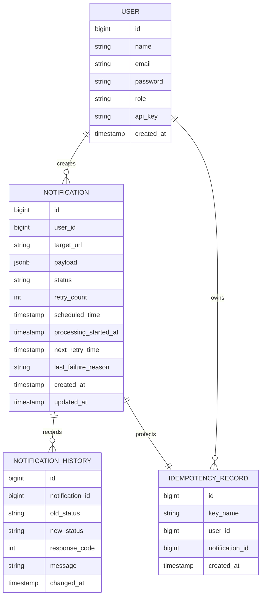

# Relay Hub — Api

## API Endpoints

### Authentication

| Method | Endpoint | Description | Authentication |
| :--- | :--- | :--- | :--- |
| `POST` | `/auth/register` | Register a new user | Public |
| `POST` | `/auth/login` | Authenticate a user and obtain a JWT | Public |

### Notifications

| Method | Endpoint | Description | Authentication |
| :--- | :--- | :--- | :--- |
| `POST` | `/api/notifications` | Create and schedule a notification | JWT / API Key |
| `GET` | `/api/notifications/{id}` | Get a user's notification | JWT / API Key |

Creating a notification requires:

```text
Idempotency-Key: <unique-key>
```

A notification request contains:

- Target webhook URL
- JSON payload
- Optional scheduled time

If `scheduledTime` is not supplied, the notification is scheduled for immediate processing.

### Administration

| Method | Endpoint | Description | Authentication |
| :--- | :--- | :--- | :--- |
| `POST` | `/api/admin/register` | Create an administrator | ADMIN |
| `GET` | `/api/admin/metrics` | Get notification counts by status | ADMIN |
| `GET` | `/api/admin/notifications` | Get system notifications with pagination | ADMIN |

---

## API Example

### Create a notification

```http
POST /api/notifications
Authorization: Bearer <jwt>
Idempotency-Key: order-12345
Content-Type: application/json
```

```json
{
  "targetUrl": "https://example.com/webhooks/orders",
  "payload": {
    "event": "order.created",
    "orderId": 12345
  },
  "scheduledTime": "2026-10-07T10:00:00Z"
}
```

### Response

```json
{
  "id": 987,
  "targetUrl": "https://example.com/webhooks/orders",
  "payload": {
    "event": "order.created",
    "orderId": 12345
  },
  "status": "PENDING",
  "retryCount": 0,
  "scheduledTime": "2026-10-07T10:00:00Z",
  "nextRetryTime": null,
  "lastFailureReason": null,
  "createdAt": "2026-10-07T09:30:00Z",
  "updatedAt": "2026-10-07T09:30:00Z"
}
```

---

## Notification Data Model

The main database entities are:



### Notifications

The `notifications` table stores the current state of each notification.

The webhook payload is stored as PostgreSQL `JSONB`, allowing Relay Hub to accept structured JSON payloads without requiring a fixed relational schema for each webhook type.

### Notification History

The `notification_history` table stores status transitions and delivery information.

It records:

- Previous status
- New status
- HTTP response code
- Failure or transition message
- Time of the transition

### Idempotency Records

The `idempotency_records` table associates an idempotency key with the notification created by that request.

A unique constraint on the user and key prevents duplicate creation.

---

### Why JSONB for the payload?

Webhook payloads can have different structures depending on the client and event.

PostgreSQL `JSONB` allows Relay Hub to store structured JSON without forcing every webhook type into the same relational schema.