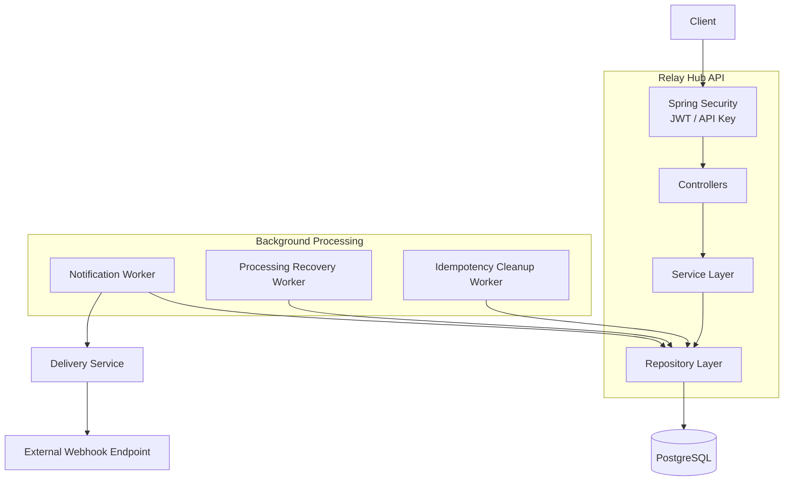
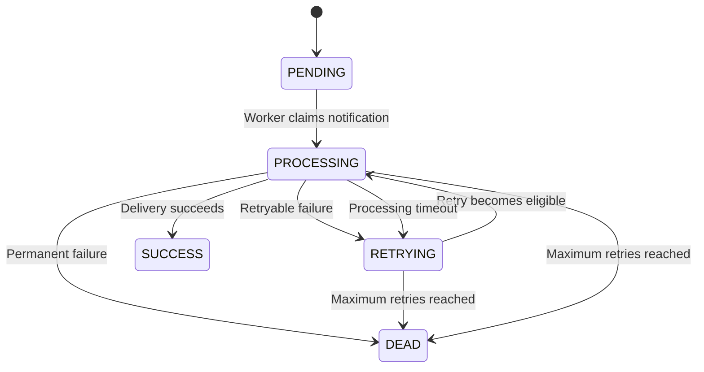
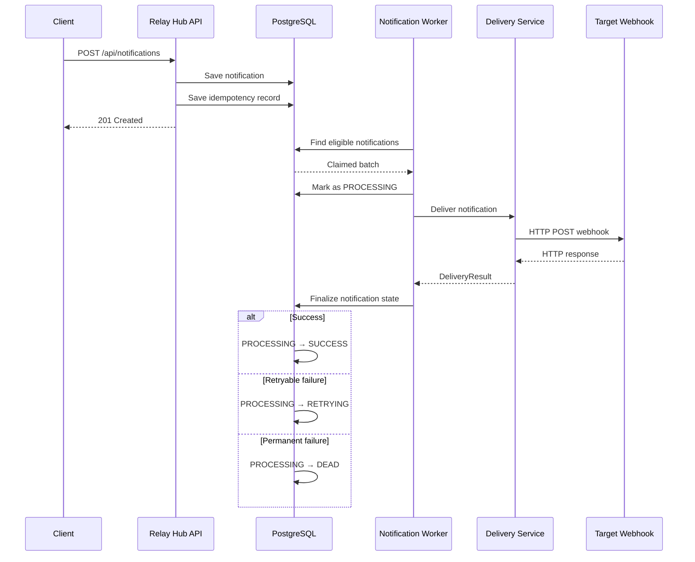

# Relay Hub — Architecture

## Architecture

Relay Hub follows a layered Spring Boot architecture.

The HTTP layer receives requests, the service layer contains application logic, repositories handle persistence, and background workers process notifications independently of API requests.



The API and worker components share PostgreSQL as the source of truth. The worker does not depend on an in-memory queue, so notification state remains available across application restarts.

---

## Notification Lifecycle

A notification starts as `PENDING` and is claimed by a worker when it becomes eligible for processing.



The normal successful path is:

```text
PENDING
   ↓
PROCESSING
   ↓
SUCCESS
```

A temporary failure follows:

```text
PENDING
   ↓
PROCESSING
   ↓
RETRYING
   ↓
PROCESSING
   ↓
SUCCESS
```

A permanent failure follows:

```text
PENDING
   ↓
PROCESSING
   ↓
DEAD
```

The notification history table records these transitions so the current status is not the only record of what happened.

---

## Notification Delivery Flow

The API does not make the external webhook request directly.

The notification is persisted first and picked up by the background worker.



This keeps the API request independent from the availability and response time of the target webhook service.

---

## Concurrent Worker Processing

Multiple workers can process notifications concurrently.

The notification query uses PostgreSQL row-level locking:

```text
FOR UPDATE SKIP LOCKED
```

Conceptually:

```text
                 PostgreSQL
                     │
          ┌──────────┴──────────┐
          │                     │
       Worker 1              Worker 2
          │                     │
          ▼                     ▼
   Notification A        Notification B
      claimed               claimed
          │                     │
          ▼                     ▼
     PROCESSING             PROCESSING
```

When a worker locks a notification, another worker skips that row and can claim another eligible notification instead.

This allows multiple worker instances to coordinate through the database without processing the same notification at the same time.

---

### Why use PostgreSQL as the source of truth?

Notification state needs to survive application restarts.

If the application stops while notifications are waiting for delivery, those notifications should still exist when the application starts again.

Keeping notification state in PostgreSQL provides that durability and also allows workers to query notifications based on their current state and scheduled time.

### Why use a database-backed worker instead of an in-memory queue?

The main requirement of Relay Hub is reliable delivery.

An in-memory queue would lose queued work if the application process stopped.

With PostgreSQL, notification state is persisted and can be recovered after an application restart.

It also gives multiple worker instances a shared source of truth.

### Why `FOR UPDATE SKIP LOCKED`?

Multiple workers may attempt to process notifications at the same time.

`FOR UPDATE` locks the selected rows, while `SKIP LOCKED` allows another worker to skip rows that another worker has already claimed.

This allows workers to coordinate through PostgreSQL without processing the same notification concurrently.

### Why separate claiming and delivery?

The worker first claims the notification and commits the state change to `PROCESSING`.

Only after that does it make the external HTTP request.

This avoids keeping a database transaction open while waiting for an external server.

It also gives the recovery worker enough information to identify notifications that were left in `PROCESSING`.

### Why finalize delivery in a separate transaction?

The external HTTP request happens outside the transaction used to claim the notification.

After the request completes, `finalizeDelivery()` starts a new transaction and locks the notification using a pessimistic write lock before updating its state.

This keeps the database transaction focused on the state update rather than the network request.